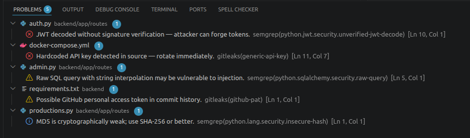

# sarifview

A VS Code / VSCodium extension that automatically populates the **Problems panel**
from `.sarif` files in your workspace — no clicking, no file pickers, no hidden-directory
friction.



## The Problem

SARIF is the standard output format for security scanners (Semgrep, Gitleaks, Grype, etc.).
VS Code can display SARIF results, but existing extensions require you to manually open
each file through a picker every session. On Linux, the picker hides dotfiles, making the
common `.sarif/` convention a pain to navigate.

This extension watches a directory and loads everything automatically on startup and
whenever files change.

## Installation

### From source

```bash
git clone https://github.com/cschooley/sarifview
cd sarifview
npm install
npm run compile
npm run package
code --install-extension sarifview-*.vsix
```

## Usage

1. Put `.sarif` files in a `.sarif/` directory at your workspace root.
2. Open VS Code — findings appear in the Problems panel immediately.
3. Click any problem to jump to the file and line.

Suppressed findings (e.g. from `# nosemgrep` inline comments) are automatically
excluded and do not appear in the Problems panel.

## Configuration

| Setting | Default | Description |
|---------|---------|-------------|
| `sarifview.directory` | `.sarif` | Directory to scan for `.sarif` files, relative to the workspace root |

```json
// .vscode/settings.json
{
  "sarifview.directory": ".sarif"
}
```

## Commands

| Command | Description |
|---------|-------------|
| `SARIF View: Refresh` | Force a reload of all `.sarif` files |

Available in the Command Palette (`Ctrl+Shift+P`).

## Pairing with Security Scanners

A typical workflow: run your scanners in CI, download the SARIF artifacts locally,
and let this extension surface the results.

```bash
# Example: fetch from GitHub Actions artifacts
gh run download <run-id> --name semgrep-sarif --dir .sarif
gh run download <run-id> --name gitleaks-sarif --dir .sarif
gh run download <run-id> --name grype-sarif --dir .sarif
```

The extension picks up the new files automatically.

## What This Extension Does Not Do

- Custom SARIF panel or tree view
- Inline triage actions
- Writing suppressions back to `.semgrepignore` or `.grype.yaml`
- Fetching SARIF from CI (use a shell script for that)

See [CLAUDE.md](CLAUDE.md) for full design rationale.

## Trying It Out

A sample SARIF file with findings at all severity levels from multiple tools is included at [`fixtures/example.sarif`](fixtures/example.sarif), along with a matching dummy source file at [`fixtures/example-target.py`](fixtures/example-target.py) so you can also try jumping from a Problem to its file and line.

1. Copy `fixtures/example.sarif` into your workspace's `.sarif/` directory.
2. Copy `fixtures/example-target.py` into your workspace root.
3. Findings appear in the Problems panel — click one to jump straight to the corresponding line.

All findings in this fixture are clearly labeled sample data, not real issues.

## License

MIT
